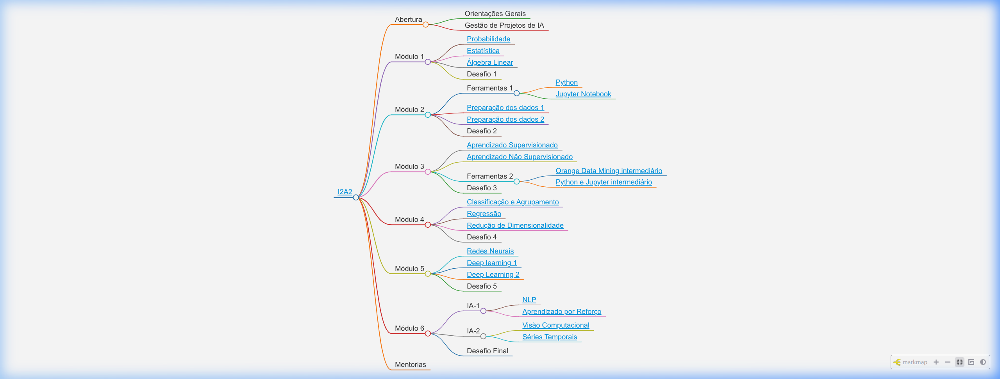

# I2A2 - Instituto de Inteligência Artificial Aplicada

  

Este repositório contém os materiais de aula, desafios e o mapa mental interativo do curso do **I2A2 (Instituto de Inteligência Artificial Aplicada)**. Os materiais são estruturados em notebooks Jupyter (.ipynb) focados no aprendizado prático e conceitual de Inteligência Artificial e Machine Learning.

---

## 🗺️ Mapa Mental Interativo
Acesse o mapa mental interativo para visualizar a jornada completa do curso e navegar diretamente para os materiais de cada aula:
👉 **[Mapa Mental Interativo (nbviewer)](https://nbviewer.org/github/vsvasconcelos/i2a2/blob/main/mapamental.html)**

  

---

## 📚 Estrutura do Curso

### 🏁 Abertura
*   **Orientações Gerais**
*   **Gestão de Projetos de IA**
*   **Competências de Carreira**: [Soft Skills](SoftSkills.ipynb)

### 📊 Módulo 1: Fundamentos Matemáticos
*   [Probabilidade](m1_probabilidade.ipynb)
*   [Estatística](m1_estatistica.ipynb)
*   [Álgebra Linear](m1_algebralinear.ipynb)
*   *Desafio 1*

### ⚙️ Módulo 2: Ferramentas & Preparação de Dados
*   **Ferramentas 1**: [Python](m2_python.ipynb) | [Jupyter Notebook](m2_Jupyter.ipynb)
*   [Preparação de Dados - Parte 1](m2_prepdados_p1.ipynb)
*   [Preparação de Dados - Parte 2](m2_prepdados_p2.ipynb)
*   *Desafio 2*

### 🤖 Módulo 3: Aprendizado de Máquina (Introdução)
*   [Aprendizado Supervisionado](m3_aprendsuper.ipynb)
*   [Aprendizado Não Supervisionado](m3_aprendnaosuper.ipynb)
*   **Ferramentas 2**: [Orange Data Mining Intermediário](m3_orange.ipynb) | [Python e Jupyter Intermediário](m3_pythoninter.ipynb)
*   *Desafio 3*

### 📈 Módulo 4: Aprendizado de Máquina (Avançado)
*   [Classificação e Agrupamento](m4_classagrup.ipynb)
*   [Regressão](m4_regressao.ipynb)
*   [Redução de Dimensionalidade](m4_reducdimensi.ipynb)
*   *Desafio 4*

### 🧠 Módulo 5: Redes Neurais & Deep Learning
*   [Redes Neurais](m5_redesneurais.ipynb)
*   [Deep Learning 1](m5_dl1.ipynb)
*   [Deep Learning 2](m5_dl2.ipynb)
*   *Desafio 5*

### 🚀 Módulo 6: Tópicos Especiais de IA
*   **IA - Parte 1**: [Processamento de Linguagem Natural (NLP)](m6_nlp.ipynb) | [Aprendizado por Reforço](m6_aprendreforco.ipynb)
*   **IA - Parte 2**: [Visão Computacional](m6_visao.ipynb) | [Séries Temporais](m6_seriestemporais.ipynb)
*   *Desafio Final*

---

## 👥 Como Contribuir
Se encontrar algum link quebrado ou tiver sugestões para melhorar o material, sinta-se à vontade para abrir uma *Issue* ou enviar um *Pull Request*.

---

  <b>Visitas desde 15/08/2026</b> 
  

